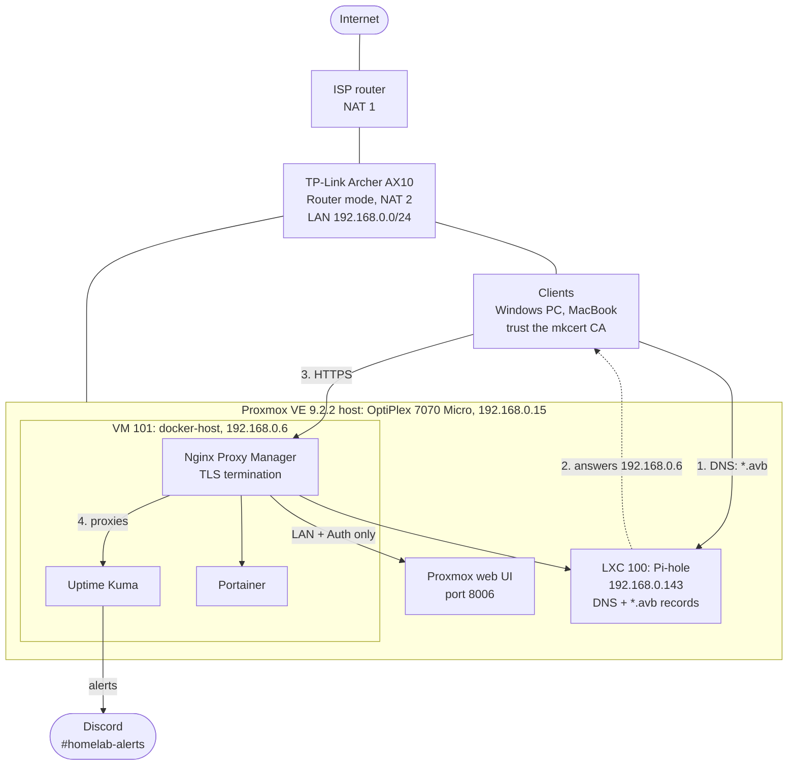
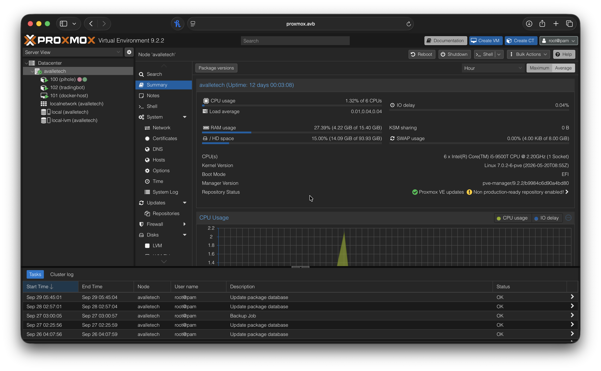
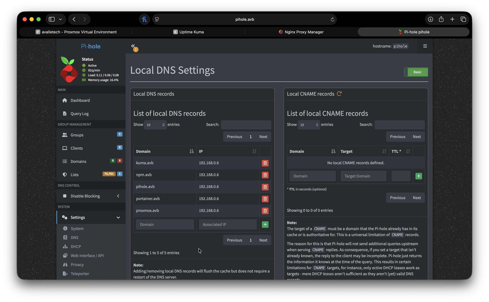
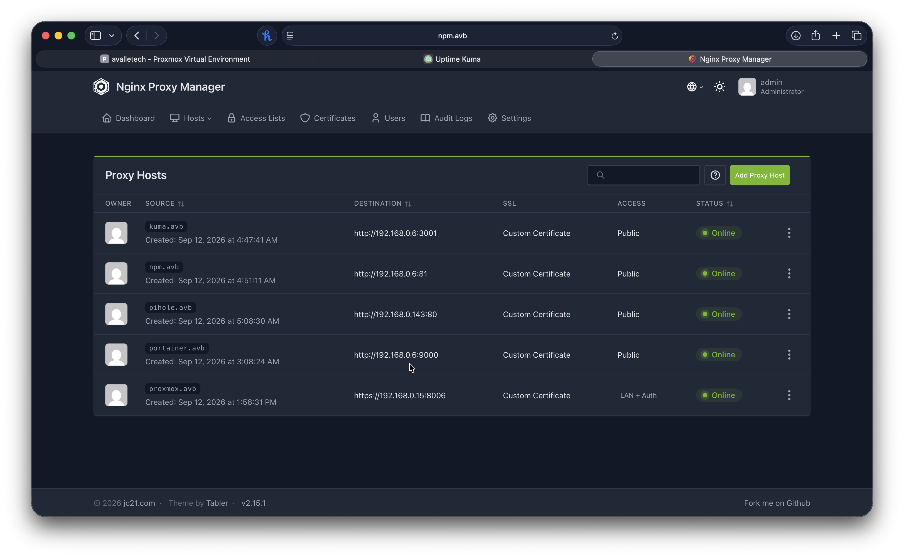
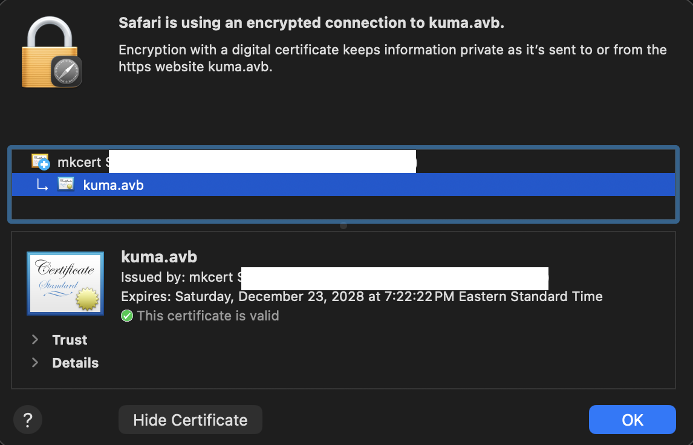
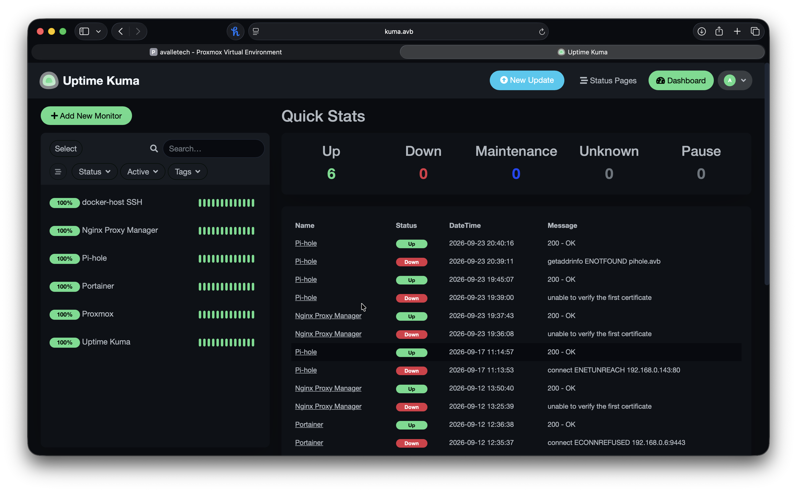
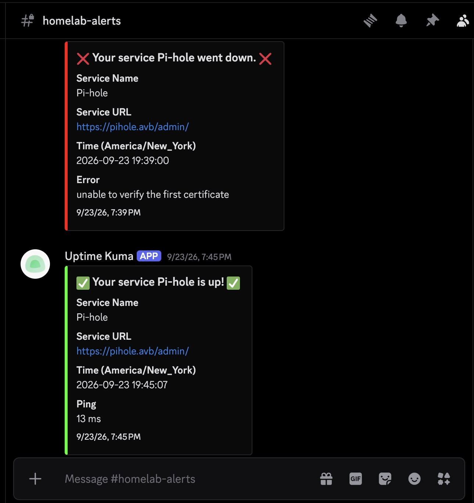

# Homelab: Proxmox VE on a Dell OptiPlex 7070 Micro

A self hosted lab I built to practice IT Operations skills outside of work and school: virtualization, DNS, reverse proxying, internal TLS, and service monitoring with alerting.



## Goals

* Run real infrastructure services the way a small IT department would
* Catch failures through monitoring and alerts instead of finding them by accident
* Document everything, including what broke and how I fixed it

## Hardware

| Component | Spec |
|---|---|
| Host | Dell OptiPlex 7070 Micro |
| CPU | Intel Core i5 9500T (6 cores) |
| RAM | 16 GB |
| Storage | 512 GB |
| Hypervisor | Proxmox VE 9.2.2 |

The OptiPlex runs headless. I manage it through the Proxmox web UI and reach project VMs over RDP from my main PC.



**About the repository warning in the screenshot:** Proxmox flags any update source other than its paid enterprise repository. This lab runs without a subscription, so it pulls updates from the free `pve-no-subscription` repository instead. For a single node lab that trade off is intentional. In a production environment I would use the enterprise repository, which gets updates only after wider testing.

## Services

| Service | Purpose | Runs as | Hostname |
|---|---|---|---|
| Proxmox VE | Hypervisor, VM and container management | Host (node `avalletech`) | `proxmox.avb` |
| Pi-hole | Network wide DNS and ad blocking | LXC container (ID 100) | `pihole.avb` |
| Docker host | Runs the containerized services below | VM (ID 101) | n/a |
| Portainer | Web UI for managing Docker containers | Docker | `portainer.avb` |
| Nginx Proxy Manager | Reverse proxy and TLS termination | Docker | `npm.avb` |
| Uptime Kuma | Service monitoring with Discord alerts | Docker | `kuma.avb` |

## Architecture

### Name resolution

Services are reached by friendly hostnames on an internal `.avb` domain (for example `kuma.avb` and `npm.avb`) instead of IP address and port combinations.

Pi-hole is the DNS server for the lab. It holds a local A record for every `.avb` name, and all of them point to `192.168.0.6`, the Docker host where Nginx Proxy Manager listens. NPM then reads the requested hostname and forwards the request to the right service. Adding a new service only takes two steps: one DNS record and one proxy host.

| Record | Points to |
|---|---|
| `kuma.avb`, `npm.avb`, `pihole.avb`, `portainer.avb`, `proxmox.avb` | `192.168.0.6` (Nginx Proxy Manager) |

Pi-hole also blocks ads and trackers network wide using a blocklist of about 75,000 domains.



### Reverse proxy and internal HTTPS

Nginx Proxy Manager sits in front of the web services and handles TLS.

1. Created a private certificate authority with **mkcert**
2. Issued a certificate for the internal services and loaded it into Nginx Proxy Manager
3. Installed the CA as trusted on client devices:
   * Windows PC (system store, plus Firefox, which keeps its own certificate store)
   * MacBook (Keychain)

Result: internal services load over HTTPS with no browser warnings. The browser shows a two level chain, with the mkcert root CA trusted by the OS and the service certificate (for example `kuma.avb`) issued by it. The current service certificate expires December 23, 2028.

> The CA private key stays on the machine that generated it and is not stored in this repo.

Proxy host map (Nginx Proxy Manager v2.15.1):

| Hostname | Forwards to | Access |
|---|---|---|
| `proxmox.avb` | Proxmox host, HTTPS port 8006 | Access list: LAN + Auth |
| `pihole.avb` | Pi-hole LXC, port 80 | No access list |
| `kuma.avb` | Docker host, port 3001 | No access list |
| `npm.avb` | Docker host, port 81 | No access list |
| `portainer.avb` | Docker host, port 9000 | No access list |

The Proxmox UI has the most control over the lab, so it gets an extra layer: an NPM access list that only allows LAN addresses and requires a login before the Proxmox login page even loads.




### Monitoring and alerting

Uptime Kuma checks every core service and sends alerts to a Discord channel when something goes down or recovers.

| Monitor | Check type |
|---|---|
| Proxmox | HTTPS, direct to the host IP on port 8006 (bypasses the proxy; TLS verification off because Proxmox uses a self signed certificate) |
| Pi-hole | HTTPS (`https://pihole.avb/admin/`) |
| Docker host | SSH (TCP port 22) |
| Portainer | HTTP(S) |
| Nginx Proxy Manager | HTTP(S) |
| Uptime Kuma | Self check |




## Backups

A scheduled Proxmox backup job covers **all guests** (every VM and container).

| Setting | Value | Why |
|---|---|---|
| Mode | Snapshot | Guests keep running during the backup, no downtime |
| Compression | zstd | Fast compression with a good size ratio |
| Notifications | Proxmox global notification settings | Failed backups are reported instead of failing silently |
| Storage | `local` (the host's own disk) | Simple to start with; see the note below |

The job shows in the Proxmox task log (see the dashboard screenshot above), completing successfully on Sunday, September 27 at 3:00 AM.

**Known limitation:** the backups live on the same physical disk as the VMs they protect. They cover mistakes like a bad update or a deleted file, but a drive failure would take out the guests and their backups together. Moving backups to separate storage is on the roadmap, following the 3 2 1 rule: 3 copies, on 2 different media, with 1 off site.

## Network

Current layout:

```
Internet
   |
ISP router (NAT #1)
   |
TP-Link Archer AX10, Router mode (NAT #2)
   |
Home LAN: OptiPlex (Proxmox), clients
```

**Known issue: double NAT.** Two routers both perform NAT, which complicates port forwarding and adds an unnecessary layer.

**Planned fix:** switch the Archer AX10 to Access Point mode so the ISP router is the only device doing routing and NAT.

## Troubleshooting log

Real problems I hit and how I resolved them.

### Uptime Kuma rejected the internal certificates
**Symptom:** Monitors went Down with `unable to verify the first certificate`. It happened first on the Proxmox monitor, then on Nginx Proxy Manager and Pi-hole after I moved them to HTTPS, and again on September 23 after I reissued the mkcert certificate. Discord alerted at 7:39 PM and reported recovery at 7:45 PM, about 6 minutes from detection to fix (see the Discord screenshot above).
**Cause:** Uptime Kuma is a Node.js app, and Node checks certificates against its own built in list of certificate authorities, not the operating system's trust store. Trusting the mkcert CA on my PC and Mac made browsers happy, but the Uptime Kuma container still had no idea who that CA was. Proxmox's default self signed certificate failed for the same reason.
**Fix:** Enabled "Ignore TLS/SSL errors" on the affected monitors so they check availability without validating the certificate chain.
**Lesson:** That fix gets the dashboard green, but the monitor would no longer notice an expired or broken certificate. The proper fix is to give the container the mkcert root CA (mount it and set `NODE_EXTRA_CA_CERTS`) and turn verification back on. That is on the roadmap.

### Monitoring blocked by an NPM access list
**Symptom:** A monitor for a proxied service (`npm.avb` or `pihole.avb`) went Down briefly with what I recall was an HTTP `403 Forbidden`.
**Cause:** The proxy host had an access list requiring authorization, and Uptime Kuma's requests were not on the allow list, so NPM rejected them before they reached the service.
**Fix:** Added an allow rule for Uptime Kuma's IP to the access list.
**Lesson:** When you lock down a service, your monitoring is a client too. Allow it explicitly or the lockdown shows up as an outage.

### Short outages that recovered on their own
**Symptom:** Three one off Down events, each back Up within about a minute:
* Pi-hole: `getaddrinfo ENOTFOUND pihole.avb` (DNS lookup failed)
* Portainer: `connect ECONNREFUSED` on port 9443 (nothing listening on the port)
* Pi-hole: `connect ENETUNREACH` on port 80 (no network route at that moment)

**Cause:** Transient. Each one cleared without any change on my part, while I was actively reconfiguring the lab.
**Lesson:** Monitoring catches even one minute blips, so there is a timestamped record to check against when something felt slow. Reading the error type tells you which layer failed: DNS, the service itself, or the network.

<!-- Copy this template for each entry:

### Short title of the problem
**Symptom:** what I saw
**Cause:** what was actually wrong
**Fix:** what I changed
**Lesson:** what I would check first next time
-->

## Roadmap

* [ ] Switch AX10 to Access Point mode and remove double NAT
* [ ] Move backups off the host disk (USB drive, NAS, or Proxmox Backup Server), then add an off site copy
* [ ] Renew the internal service certificate before it expires (December 2028)
* [ ] Trust the mkcert CA inside Uptime Kuma (`NODE_EXTRA_CA_CERTS`) and re-enable TLS verification on the monitors

## Skills demonstrated

Proxmox VE, virtualization, Linux administration, Docker, Portainer, DNS (Pi-hole), reverse proxying (Nginx Proxy Manager), internal PKI and TLS (mkcert), service monitoring and alerting (Uptime Kuma, Discord webhooks), SSH, RDP, home network troubleshooting.
